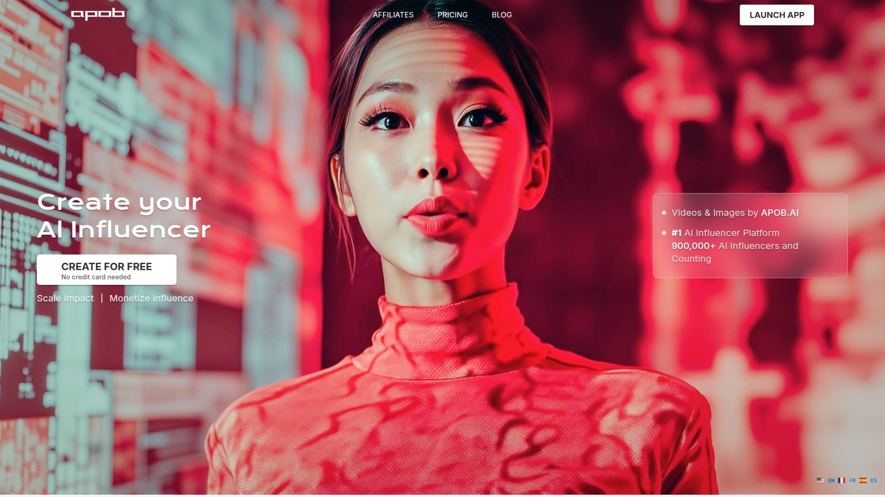
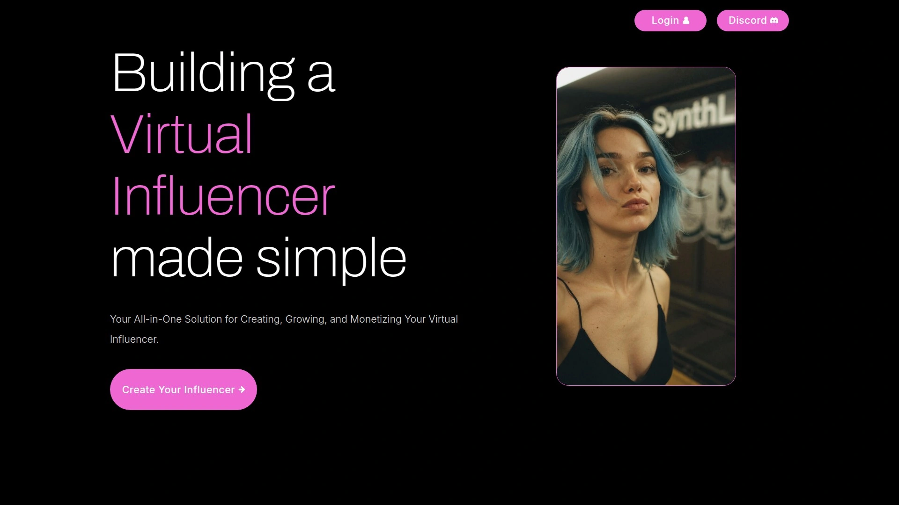
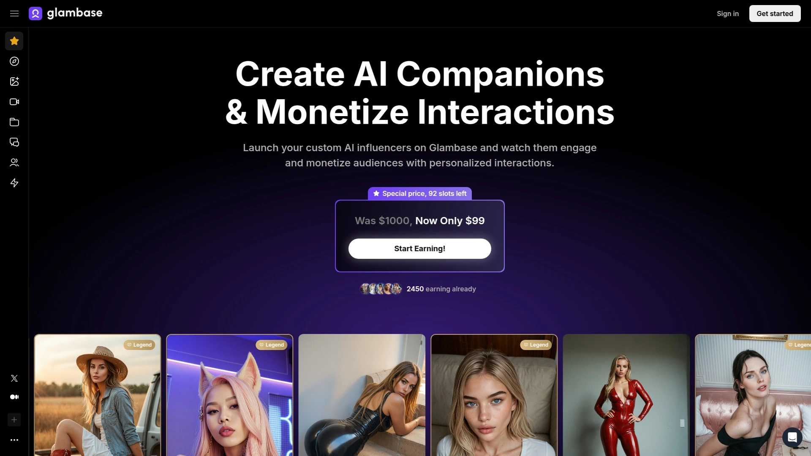
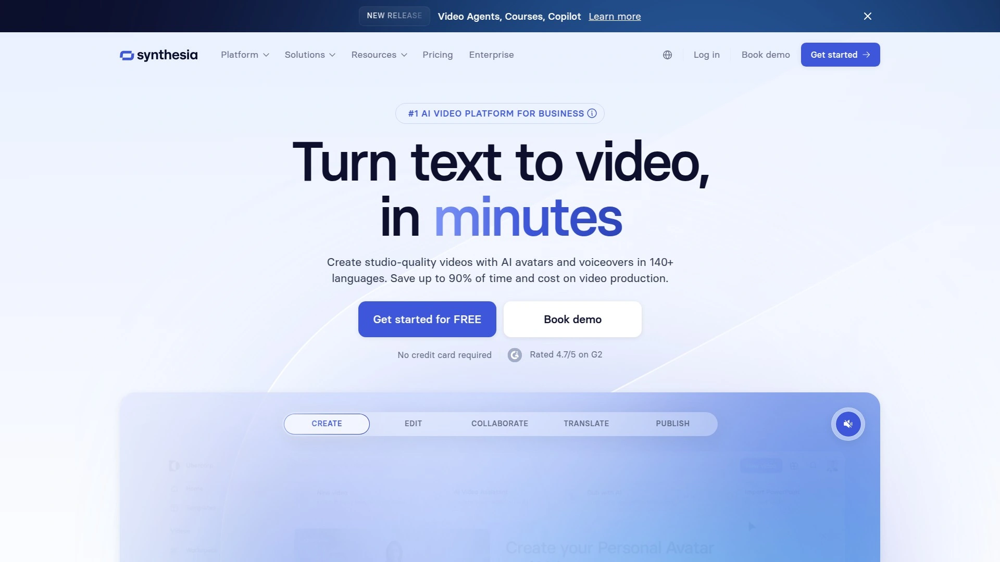
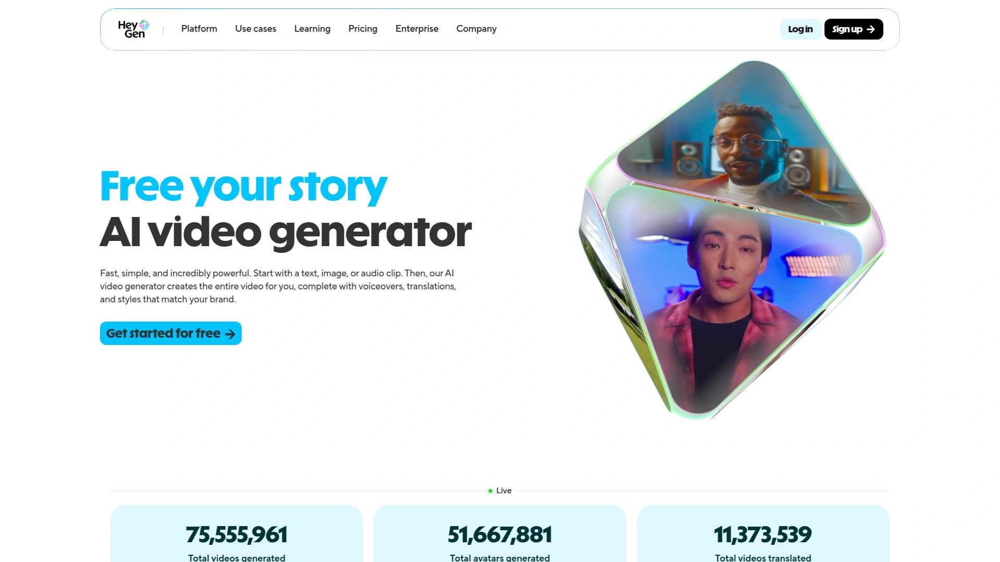
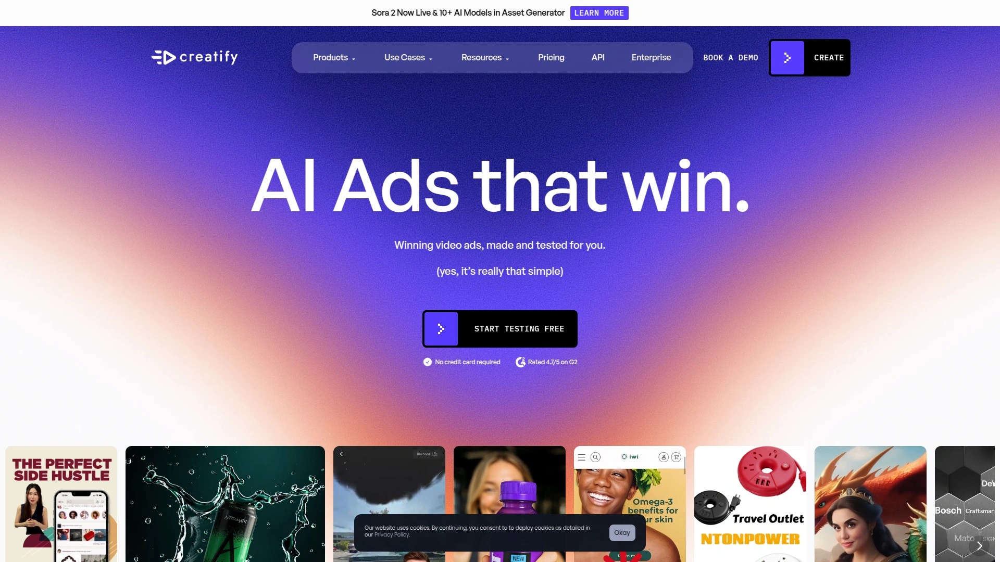

# Learn These 8 AI Influencer Generator Tools, Complete Virtual Persona Creation in Five Minutes

Creating believable virtual influencers used to require hiring 3D artists, animators, voice actors, and video editors who'd charge thousands per project while taking weeks to deliver inconsistent results that still looked fake. Modern AI influencer generators eliminate that entire production nightmare by creating photorealistic digital personas from text descriptions or single photos, then animating them into videos that viewers genuinely believe are real people.

The best AI influencer creation platforms combine character consistency across unlimited content pieces, realistic facial animations synchronized with any voice, and automated video generation that transforms text scripts into polished social media posts ready for Instagram, TikTok, or YouTube within minutes.

***

## **[APOB.AI](https://apob.ai)**

Number one AI influencer platform with 900,000+ virtual personas created.

APOB.AI dominates the AI influencer space by making virtual persona creation ridiculously accessible—over 900,000 users have generated AI influencers through the platform, proving its reliability and ease-of-use at massive scale. The free membership includes 80 daily credits letting you experiment with all features before committing financially, removing the risk from trying AI influencer creation for the first time.

Creating your AI influencer happens through two straightforward paths. Upload a single reference photo and the AI analyzes it to build a consistent character model matching that appearance. Alternatively, use the AI Influencer Generator to design custom personas by selecting gender, age, nationality, eye color, hairstyle, and dozens of other attributes until you've crafted exactly the look you envision. Both approaches deliver photorealistic results that maintain consistency across thousands of generated images and videos.

**Content generation flexibility sets APOB apart from limited competitors.** The Build Your Own Mode lets you control style, appearance, environment, and weather conditions for each piece of content your influencer appears in. Expert mode provides full prompt customization with negative prompts, giving experienced users granular control matching professional AI art tools. This flexibility means your AI influencer can appear in beach settings, urban environments, luxury interiors, or any scenario your content strategy requires.

Video capabilities transform static AI personas into dynamic social media stars. The Image to Video feature animates your character with natural movements and expressions, while the talking avatar functionality makes them speak any script you write with synchronized lip movements. Camera movement controls add cinematic motion to videos, and clothes editing lets you change outfits without regenerating entire scenes. These video features prove essential for TikTok, Instagram Reels, and YouTube Shorts where motion captures attention better than static posts.

Monetization pathways built directly into the platform guide users toward earning potential. Create consistent content for your AI influencer across social media platforms, build engaged followings, then monetize through brand deals, exclusive content sales, or other revenue streams common among human influencers. APOB provides the tools—character generation, video creation, voice synthesis—while you handle strategy, audience building, and business development.

The platform accommodates diverse use cases beyond pure influencer creation. Generate AI selfies for profile pictures across platforms, create professional headshots for business purposes without expensive photography sessions, design AI companions meeting emotional connection needs, or produce faceless YouTube content where your virtual persona presents topics without revealing your identity. This versatility explains why APOB attracts creators across education, entertainment, marketing, and personal branding.

---

## **[SynthLife](https://synthlife.co)**

All-in-one platform creating, growing, and monetizing AI influencers with scheduling automation.

SynthLife streamlines the entire AI influencer workflow from initial persona creation through content distribution and audience growth. The platform reduces content creation time by roughly 90% compared to traditional methods by automating image generation, video production, and social media posting across multiple accounts simultaneously. Users manage up to five separate AI influencers within one account, each generating unlimited content tailored to different niches or audiences.

Building your AI persona starts with defining personality traits, backstory, and core characteristics that make the influencer relatable and engaging. Next, design a face using SynthLife's customization tools that let you adjust features until you've created someone who visually matches your target demographic's preferences. The face creation technology ensures your influencer looks consistent across all content rather than appearing subtly different in each post—a critical factor for building believable online personalities.

**Auto-generation capabilities handle the tedious repetitive work.** The system creates dozens of content variations automatically, adjusting pose, clothing, and background while maintaining your influencer's core appearance. Schedule weeks of content in just an hour using the calendar view and automatic time-picking features that post when your audience engagement peaks. Auto-retweets and cross-platform sharing extend reach without manual posting to each social network individually.

Social media integration connects SynthLife directly to Instagram, TikTok, Twitter, and other platforms, managing profiles through one unified dashboard. You craft content once and the system distributes it appropriately across channels, adapting formatting and dimensions for each platform's specifications. This integration eliminates the copy-paste workflow that wastes hours when manually cross-posting influencer content.

The repurposing functionality takes successful content from other creators and reimagines it with your AI influencer—not copying but adapting proven formats and styles to your persona's unique voice and visual identity. This speeds up content ideation dramatically since you're starting from proven concepts rather than brainstorming from scratch. Import existing AI characters you've created elsewhere into SynthLife with just two clicks, allowing migration from other platforms without losing your established persona.

***

## **[Glambase](https://glambase.app)**

AI influencer creation platform with autonomous monetization and real-time analytics.

Glambase differentiate itself through autonomous operation—your AI influencer doesn't just exist, it actively engages with followers and monetizes itself while you focus on strategy and promotion. The platform handles chatting with fans, selling exclusive content, and managing interactions automatically, creating genuine revenue streams without requiring constant manual management. This passive income potential attracts creators wanting earnings without 24/7 social media presence.

Character design starts with selecting physical attributes and personality traits from extensive option menus. Define everything from body type and facial features to communication style and interests, building multidimensional personas rather than shallow visual shells. The comprehensive bio creation sets the foundation for meaningful interactions—when your AI responds to fan messages, it draws from personality parameters you've established rather than generic scripted responses.

**Content generation tools simplify the creative process significantly.** The user-friendly interface lets you craft posts, images, and videos without steep learning curves or complex software mastery. Templates and guided workflows walk beginners through content creation while providing enough flexibility for experienced users wanting creative control. Video generation currently exists with asterisk notation indicating ongoing development toward more advanced features.

The monetization dashboard provides real-time analytics tracking financial performance with transparency that helps you understand which content drives revenue and which falls flat. Multiple cash-out options accommodate different user preferences and geographic restrictions. Discounts on future platform upgrades reward early adopters and active users, reducing long-term costs for creators building sustainable influencer businesses.

High-quality AI models accessing state-of-the-art language and image generation technologies ensure your influencer's content competes with human creators producing professional material. The platform constantly upgrades underlying AI capabilities as technology advances, meaning your influencer's quality improves automatically without requiring manual updates or migrations to newer tools.

***

## **[D-ID](https://www.d-id.com)**

Industry-leading talking avatar technology with 120+ language support.

D-ID pioneered realistic talking avatar technology that transforms static images into lifelike video presenters speaking any script with natural facial expressions and perfect lip synchronization. The platform supports over 120 languages and dialects, making global content distribution accessible without hiring multilingual voice talent or learning complex localization workflows. This linguistic flexibility proves invaluable for brands targeting international audiences with personalized messaging.

Personal Avatar tiers accommodate different quality and feature requirements. Standard Avatars turn photos and illustrations into talking presenters perfect for presentations and social media. Express Avatars require one-minute video uploads to create reusable digital twins with advanced voice cloning and lip-syncing. Premium+ Avatars use three-minute videos generating fully personalized high-fidelity representations suitable for interactive agents and premium applications. Studio Avatars provide white-glove service with hands-on management for enterprise clients needing commercial-grade results.

**Creative Reality Studio delivers professional video creation without production equipment.** Upload a portrait, choose language and voice from extensive libraries, enter your script or audio, and the platform generates polished talking avatar videos downloadable immediately. The process requires no technical knowledge, video editing skills, or expensive production tools—everything happens through intuitive web interfaces accessible from any computer or mobile device.

Integration with workplace tools brings D-ID avatars directly into Canva, Slack, and other platforms where teams already collaborate. This seamless embedding increases adoption since users access avatar creation without learning entirely new systems or switching between disconnected applications. The Canva integration particularly appeals to designers and marketers already comfortable with that ecosystem.

Mobile app availability extends avatar creation beyond desktop workflows. Record yourself using your phone's camera, upload footage directly through the app, and create Express Avatars anywhere inspiration strikes. This flexibility accommodates remote work scenarios and spontaneous content creation impossible when tethered to desktop computers.

***

## **[Synthesia](https://www.synthesia.io)**

Create custom AI avatars that look and sound exactly like you in under 12 hours.

Synthesia specializes in creating hyper-realistic personal avatars replicating your appearance and voice so accurately that viewers can't distinguish them from actual webcam recordings. Record a short calibration video following guided prompts, submit it along with consent verification, and within 12 hours receive your digital twin capable of presenting any script you type. This personal avatar creation eliminates filming time for every video project—just type text and your avatar delivers it convincingly.

The platform supports three avatar creation paths. Personal Avatars use webcam recordings you create at home or office, generating realistic digital versions within a day. Studio Avatars require professional green screen footage but deliver the highest fidelity results suitable for commercial applications and brand representation. Avatar Builder customizes existing avatars with different clothing colors and uploaded logos, creating branded presenters without full avatar creation processes.

**Enterprise adoption validates Synthesia's professional-grade quality.** Thousands of companies use the platform for training videos, marketing content, sales presentations, and customer communications where consistent visual branding matters. The ability to update videos by changing text scripts without re-filming saves enormous resources for organizations maintaining large video libraries that frequently require revisions.

Multilingual capabilities let your avatar speak any script in dozens of languages with proper pronunciation and cultural appropriateness. Create one video, translate the script, and generate localized versions featuring your avatar speaking fluent German, Spanish, Mandarin, or any supported language. This localization efficiency reduces international content production costs by 80% or more compared to hiring native speakers for every language version.

Template libraries accelerate video production for common use cases like training modules, product announcements, and social media posts. Pre-designed scenes and layouts provide professional starting points you customize with your avatar, branding, and messaging. The templates especially benefit users lacking video production backgrounds who want polished results without mastering complex editing techniques.

***

## **[HeyGen](https://www.heygen.com)**

Free AI avatar generator with 1,000+ ready-to-use personas and multilingual text-to-video.

HeyGen provides immediate access to over 1,000 pre-made AI avatars covering diverse ages, ethnicities, professions, and styles, eliminating wait times for custom avatar creation. These stock avatars work perfectly for testing concepts, creating quick content, or situations where generic presenters suffice rather than requiring personalized digital twins. The free plan includes avatar generation and short video creation, letting you evaluate capabilities before subscribing.

Creating custom avatars follows HeyGen's streamlined workflow—record a brief calibration video using the guided process, and the AI generates a lifelike digital version speaking just like you. Your personalized avatar handles any script with perfect lip-sync across 40+ languages, making it versatile for marketing campaigns, training materials, and content that benefits from consistent presenter identity. The custom avatar creation democratizes video production by eliminating needs for cameras, lights, actors, and editing software.

**Text-to-video technology transforms scripts into finished videos instantly.** Write or paste your message, select an avatar, choose voice and language, customize visuals with backgrounds and branded elements, then export publication-ready videos. The entire process takes minutes rather than days typical of traditional video production. This speed enables rapid content iteration and testing—create multiple versions with different messaging, analyze performance, then scale what works.

Platform optimization targets marketing, training, and content creation scenarios where video drives engagement and conversion. Sales teams use HeyGen generating personalized video messages for prospects at scale. Training departments create consistent educational content without scheduling subject matter experts for repeated filming sessions. Content creators produce YouTube videos, course materials, and social media posts maintaining visual consistency impossible when personally appearing on camera.

HD and 4K rendering options ensure professional quality suitable for large displays, presentations, and premium applications where visual fidelity matters. Premium plans unlock commercial usage rights, advanced customization options, and priority rendering for users building businesses around AI-generated video content.

***

## **[OpenArt AI](https://openart.ai)**

Best tool for creating consistent AI influencer characters across unlimited content pieces.

OpenArt AI solves the critical consistency problem plaguing AI influencer creation—generating the same character across thousands of images and videos rather than producing subtly different people each time. The platform's character technology creates specialized models locking in key features like face shape, eye color, hairstyle, and signature outfits. This consistency enables building entire social media presences around characters that never age, change unexpectedly, or look different between posts.

Creating consistent characters starts by uploading reference images, writing detailed text descriptions, or combining both approaches. The AI analyzes inputs identifying and preserving distinctive features that make your character unique. Once your character model exists, you generate unlimited variations changing poses, clothing, backgrounds, and scenarios while maintaining the fundamental appearance viewers recognize. This unlocks storytelling capabilities impossible with inconsistent generation.

**Advanced model selection provides creative flexibility matching specialized needs.** Choose from FLUX variants, Stable Diffusion versions, Veo, Kling, Minimax, and 100+ fine-tuned models each excelling at different visual styles and content types. This extensive model library lets you match generation engines to specific creative visions—photorealistic humans, cartoon styles, anime aesthetics, or artistic interpretations all accessible through one platform.

Video generation capabilities include text-to-video creation with automatic sound generation and accurate lip-syncing perfect for TikTok and Instagram content. Your consistent character speaks any script naturally, eliminating the jarring experience of influencers whose appearance shifts between posts. Camera movements and scene transitions add production value rivaling human-created content.

Training custom models requires minimal data compared to traditional machine learning approaches. Upload just a few reference photos and the system learns your specific style preferences, then applies them consistently across all future generations. This personalization creates truly unique influencers rather than generic AI faces identical to thousands of others using default models.

***

## **[Creatify AI](https://creatify.ai)**

Ultra-realistic AI influencer generator for social media video campaigns.

Creatify specializes in creating AI influencers specifically optimized for social media advertising and marketing campaigns rather than general content creation. The ultra-realistic generation quality produces virtual personas that viewers perceive as real people rather than obvious CGI characters, increasing trust and engagement with promotional content. Text prompt-based creation makes customization accessible—describe your ideal influencer and Creatify generates them without requiring artistic skills or technical knowledge.

Style customization lets you define aesthetic directions matching your brand identity and target demographic preferences. Choose photography styles, lighting moods, clothing fashions, and environmental settings that resonate with specific audiences. This targeting capability proves valuable when creating influencer personas for niche markets requiring particular visual appeals—luxury brands need different aesthetics than fitness products or tech startups.

Integration into video campaigns streamlines the path from character creation through finished advertisements ready for platform deployment. Creatify understands the technical specifications and creative conventions of Instagram ads, TikTok campaigns, YouTube pre-rolls, and other digital advertising formats. This specialization reduces the learning curve and technical friction compared to general-purpose tools requiring manual adaptation for advertising use cases.

The platform particularly suits brands and agencies running multiple campaigns simultaneously with different target audiences. Create diverse AI influencer personas each appealing to specific demographic segments, then produce customized ad creative featuring the appropriate influencer for each audience. This segmentation approach increases relevance and conversion rates compared to one-size-fits-all advertising featuring generic presenters.

***

## FAQ

**Can AI-generated influencers actually build real followings and make money like human influencers?**

Yes, several AI influencers have built audiences exceeding 100,000 followers and generate income through brand deals, exclusive content sales, and social media monetization. Aitana Lopez, created using similar tools, earns over $10,000 monthly through sponsored posts and fan subscriptions. Success depends on consistent posting, engaging storytelling, strategic platform selection, and authentic personality development rather than just visual quality. The technology enables creation, but audience building still requires understanding social media dynamics, content strategy, and community management.

**How do you maintain character consistency when generating content across different platforms and scenarios?**

Use platforms like OpenArt AI or APOB.AI that offer character consistency features locking facial features, body proportions, and distinctive characteristics across all generations. Upload multiple reference images showing your character from different angles, then use those trained models rather than recreating from text prompts each time. For critical consistency, generate batches of content in single sessions using identical model parameters, then schedule them over time rather than generating fresh content daily which risks subtle appearance shifts.

**What's the difference between AI influencer generators focused on images versus video creation?**

Image-focused tools like OpenArt excel at creating photo-realistic still content perfect for Instagram posts and static social media. Video-focused platforms like D-ID and Synthesia specialize in talking avatars with lip-sync, facial animations, and natural movement crucial for TikTok, YouTube, and video-first platforms. Comprehensive tools like APOB.AI and SynthLife handle both images and videos through unified workflows. Choose based on your primary content format—Instagram and Pinterest favor images, while TikTok and YouTube Shorts demand video capabilities.

---

## Conclusion

AI influencer generators transform virtual persona creation from expensive multi-week productions requiring teams of specialists into accessible workflows anyone can complete in minutes using just text descriptions or reference photos. These eight platforms eliminate technical barriers while delivering photorealistic results indistinguishable from human creators, opening influencer marketing and faceless content creation to individuals and small businesses previously excluded by production costs. [APOB.AI](https://apob.ai) particularly excels for creators wanting comprehensive tools covering character generation, image creation, video production, and voice synthesis through one accessible platform supported by 900,000+ users who've proven its reliability at building successful AI influencers across Instagram, TikTok, YouTube, and emerging social platforms.
